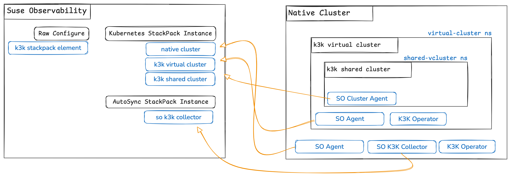

# Setup Guide

This guide contains instructions on how to setup the K3K Extension for SUSE Observability.




## Prerequisites

Ensure you have the following tools installed and properly configured:

- **[SUSE Observability CLI](https://docs.stackstate.com/cli/cli-sts)** – Command-line interface for SUSE Observability.
- **[Taskfile](https://taskfile.dev/installation/)** – A task runner for automating commands.
    - Supports tab completion, making it easy to view available tasks.
- **[Gomplate](https://docs.gomplate.ca/installing/)** – A powerful template processor.
- **[Lima](https://lima-vm.io/docs/installation/)** - Launches Linux virtual machines locally.
- **[Helm](https://helm.sh/docs/intro/install/)** – A package manager for Kubernetes.

Check out this repository and execute all commands from its root.

```bash
git clone https://github.com/ravan/so-k3k.git
cd so-k3k
```

Setup your `.env` with correct values for

```
# The working directory to resolve the KUBECONFIG_FILE_NAME
KUBECONFIG_FILE_PATH=/Users/rnaidoo/sts/repos/github/ravan/so-k3k


# --- OBSERVED CLUSTER  --- #

# If you want to setup a local cluster on a Lima VM, set
LOCAL_CLUSTER=true

# If using a remote cluster, set LOCAL_CLUSTER=false and set the name of kubeconfig file
KUBECONFIG_FILE_NAME=kubeconfig


# --- TARGET SUSE OBSERVABILITY BACKEND --- #

# Name of the instance as defined in SUSE Observability AutoSync StackPack Instance
CLUSTER_NAME=inception

# The url to your SUSE Observanility instance
SO_URL=https://xxx.io

# The Open Telemetry Protocol host name
SO_OTLP=otlp-xxx.io

# Your SUSE Observability API_KEY
SO_API_KEY=181335cxxxxxx

# Your SUSE Observability CLI Token.
SO_TOKEN=tRa6xxxxx

# --- HELM Repo --

# helm add suse-observability-addons https://ravan.github.io/helm-charts/
HELM_REPO=suse-observability-addons
```

## k3k CLI

Follow the instructions in the [k3k documentation](https://github.com/rancher/k3k?tab=readme-ov-file#install-the-k3kcli) to 
install the CLI.

## Native K3s Cluster

We will set up a local VM to host the native and virtual kubernetes clusters.

You can easily use your own cluster if desired. Set the `LOCAL_CLUSTER=false`
in your `.env` file and create a `kubeconfig` file with your clusters connections information.
Skip running the following command if you have a remote cluster setup.
This will spin up a Linux VM with k3s installed.

```bash
task dev:create-vm
```

Check if the cluster is up.

```bash
task dev:get-cluster-status
```
Make sure all `pods` are running before continuing.

**Pro Tip:** Use `kubectl` and other tools by exporting the kubeconfig.

```bash
eval $(task dev:shell-env)
kubectl get nodes
```

## K3K Virtual Cluster

Before creating a virtual cluster, we need to install the k3k operator into the host cluster.

```bash
task native-deploy-k3k-operator     
```

Next create a 3 server virtual cluster in the `virtual-cluster` namespace

```bash
task vlcuster-create
```
### Kubeconfig

Once all the server pods have been start, we can set up a kubeconfig to connect to the vcluster.


```bash
task vcluster-kubeconfig
```

### Port Forwarding

k3k generates the kubeconfig with a cluster ip that we cannot reach from our laptop. 
We automatically changed the ip to `localhost` and use port-forwarding to access the cluster api.
Open another terminal and change directory to our current working directory.

```bash
task vcluster-portforward-api
```

## K3K Shared Cluster

We next attempt to create a shared k3k cluster inside the `vcluster`.
Install the k3k operator into the `vcluster` that acts as the host cluster.

```bash
task scluster-deploy-k3k-operator     
```

Sometimes we see errors from the k3k server and the virtual kubelet complaining about too many open files.

```bash
E0218 14:39:02.024663      51 dynamic_serving_content.go:144] "Failed to watch cert and key file, will retry later" err="error creating fsnotify watcher: too many open files"

│{"level":"fatal","timestamp":"2025-02-18T14:28:16.888Z","logger":"k3k-kubelet","msg":"virtual manager stopped","error":"too many open files"}                                                                                                             │
```

We can work around these errors by increasing the limits using,

```bash
task vcluster-increase-severs-fsnotify-limits
```

Now we in a state to  create a shared cluster server in the `shared-vcluster` namespace

```bash
task scluster-create
```
### Kubeconfig

Once the server pod has been started, we can set up a kubeconfig to connect to the scluster.


```bash
task scluster-kubeconfig
```

### Port Forwarding

k3k generates the kubeconfig with a cluster ip that we cannot reach from our laptop.
We automatically changed the ip to `localhost` and use port-forwarding to access the cluster api.
Open another terminal and change directory to our current working directory.

```bash
task scluster-portforward-api
```


## Setup SUSE Observability

Before installing any agents in the demo clusters we created above, we need to prepare the SUSE Observability
instance.

### StackPack Instances

Create stackpack instances on SUSE Observability to prepare topology ingestion pipelines
to receive data from the native, virtual and shared clusters

#### Kubernetes StackPack Instance

Create an instance to receive data from the downstream observed cluster.

```bash
task native-create-k8s-stackpack-instance
task vcluster-create-k8s-stackpack-instance
task scluster-create-k8s-stackpack-instance
```

#### AutoSync StackPack Instance

You most probably do not have the AutoSync StackPack installed by default.
Upload the stackpack using,

```bash
task dev:upload-autosync-stackpack-instance
```

Next create an instance to receive data from our K3K extension.

```bash
task create-k3k-autosync-stackpack-instance
```


## Setup Observed Clusters

### SUSE Observability Agent

Lets deploy the agent to the native, k3k virtual and k3k shared clusters. Make sure all your port-forwarding tasks are running.
Wait for each agent to deploy before moving onto next cluster

```bash
task native-deploy-observability-agent
task vcluster-deploy-observability-agent
task scluster-deploy-observability-agent
```

Check SUSE Observability to make sure data from these cluster have been ingested.
Use the following query to find all the important componentes:

```
 (type = "pod" and label in("role:server")) OR
 (type = "node" AND label in ("cluster-name:vcluster","cluster-name:scluster", "cluster-name:inception")) OR 
 (type = "pod" AND label in ("cluster-name:scluster")) OR 
 (type = "pod" AND label in ("namespace:shared-vcluster") AND label = "cluster-name:vcluster")
```


### K3K Extension

#### SUSE Observability Synchronization Pipelines

After the StackPack instances are created, SUSE Observability setups up ingestion pipelines.
The pipelines can be viewed by accessing the SUSE Observability User Interface,

`Menu | Settings | Synchronizations`

We are interested in the following pipelines,

- _Kubernetes - inception_
- _Kubernetes - vcluster_
- _Kubernetes - scluster_
- _Synchronization k3k inception_

These pipelines receive data from the SUSE Observability Agent and as well as the extension we created for K3K.

We would like to enrich the Kubernetes data with K3K domain concepts and adjusting the mapping data in the pipeline
is one way. Upload the settings,

```bash
task so-upload-settings
```

For each of the pipelines we created, we need  to `Edit` via context menu item and make the following changes,

| Name                          | Mapping Function                                  | Merge Strategy       |
|-------------------------------|---------------------------------------------------|----------------------|
| Kubernetes - inception        | Kubernetes K3K generic component mapping function | Merge, prefer mine   |
| Kubernetes - vcluster         | Kubernetes K3K generic component mapping function | Merge, prefer mine   |
| Kubernetes - scluster         | Kubernetes K3K generic component mapping function | Merge, prefer theirs |
| Synchronization k3k inception | Leave Blank                                       | Merge, prefer mine   |

Please update and confirm the prompted for unlocking.

#### Deploy K3K Extension

The K3K extension analyses the Kubernetes topology data in SUSE Observability and automatically creates relations,
and reclassifies component `Layer` property. This will ensure a richer contextualized domain experience.

```bash
task native-deploy-so-k3k
```

The cron job will run every 5 minutes to sync K3K model with SUSE Observability.
If you wish to manually trigger the job run,

```bash
task native-trigger-so-k3k-job
```
